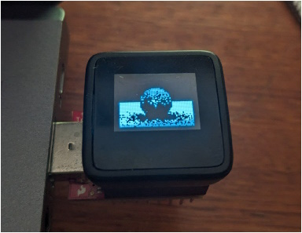

# Arduino Raytracer
<p align="center">

</p>

Barebones raytracing implementation in Arduino C++.  
Some code was adapted from https://github.com/caosdoar/arduino-raytracer/.  
This specific example is intended to run on the [Sparkfun Microview Module](https://www.sparkfun.com/products/12923), but you can easily adapt it to use a display of your choice for output.


## Features

- Vector math implementation including world <-> local space transformations for the shading frame
- Basic diffuse material with cosine weighted sampling
- Adjustable resolution, bounces, samples

If you want to use a different screen, replace `#include <Microview.h>` with your library of choice and update the functions below:
```cpp
void setup() {
	// REPLACE THIS TO USE A DIFFERENT SCREEN
	uView.begin();
	uView.clear(PAGE);
}

void drawPixel(int x, int y) {
	// REPLACE THIS TO USE A DIFFERENT SCREEN
	uView.pixel(x, y); // Screen drawing logic goes here
}
```

